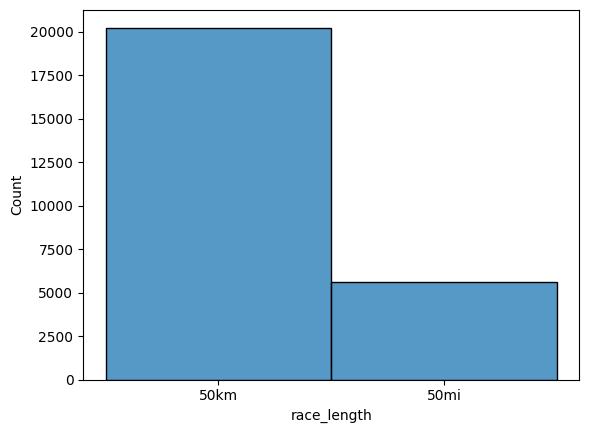
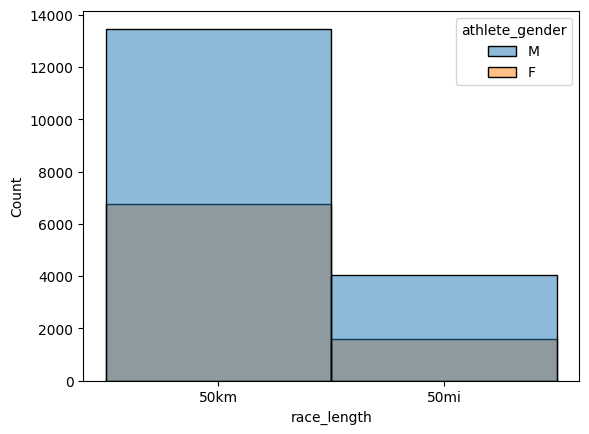
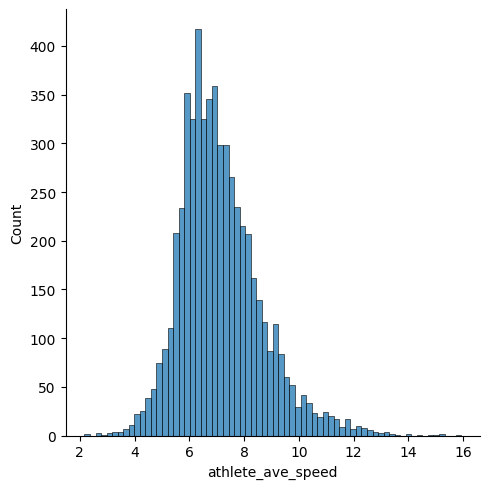
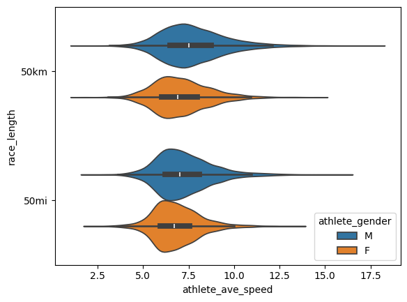
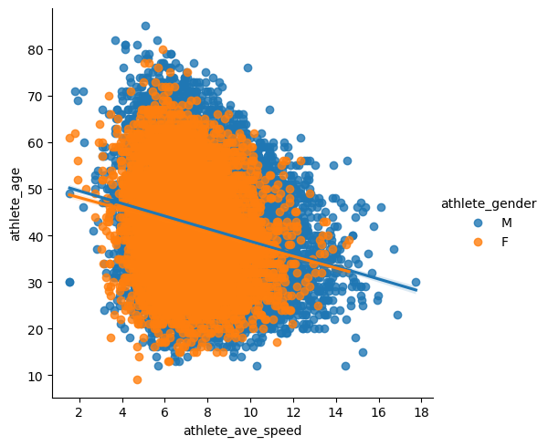
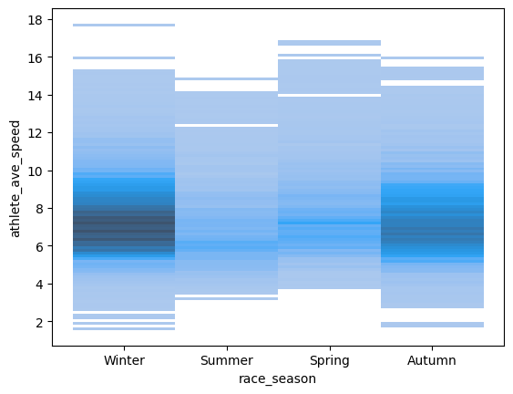

```python
# Importare il set di dati: https://www.kaggle.com/datasets/aiaiaidavid/the-big-dataset-of-ultra-marathon-running/discussion/420633
```


```python
# Importare le seguenti librerie
```


```python
import pandas as pd
```


```python
import seaborn as sns
```


```python
# Creare una nuova dataframe
```


```python
df = pd.read_csv('TWO_CENTURIES_OF_UM_RACES.csv')
```

    C:\Users\seraf\AppData\Local\Temp\ipykernel_24788\107228863.py:1: DtypeWarning: Columns (11) have mixed types. Specify dtype option on import or set low_memory=False.
      df = pd.read_csv('TWO_CENTURIES_OF_UM_RACES.csv')
    


```python
# Mostrare 2 righe
```


```python
df.head(2)
```


<div>
<style scoped>
    .dataframe tbody tr th:only-of-type {
        vertical-align: middle;
    }

    .dataframe tbody tr th {
        vertical-align: top;
    }

    .dataframe thead th {
        text-align: right;
    }
</style>
<table border="1" class="dataframe">
  <thead>
    <tr style="text-align: right;">
      <th></th>
      <th>Year of event</th>
      <th>Event dates</th>
      <th>Event name</th>
      <th>Event distance/length</th>
      <th>Event number of finishers</th>
      <th>Athlete performance</th>
      <th>Athlete club</th>
      <th>Athlete country</th>
      <th>Athlete year of birth</th>
      <th>Athlete gender</th>
      <th>Athlete age category</th>
      <th>Athlete average speed</th>
      <th>Athlete ID</th>
    </tr>
  </thead>
  <tbody>
    <tr>
      <th>0</th>
      <td>2018</td>
      <td>06.01.2018</td>
      <td>Selva Costera (CHI)</td>
      <td>50km</td>
      <td>22.0</td>
      <td>4:51:39 h</td>
      <td>Tnfrc</td>
      <td>CHI</td>
      <td>1978.0</td>
      <td>M</td>
      <td>M35</td>
      <td>10.286</td>
      <td>0.0</td>
    </tr>
    <tr>
      <th>1</th>
      <td>2018</td>
      <td>06.01.2018</td>
      <td>Selva Costera (CHI)</td>
      <td>50km</td>
      <td>22.0</td>
      <td>5:15:45 h</td>
      <td>Roberto Echeverría</td>
      <td>CHI</td>
      <td>1981.0</td>
      <td>M</td>
      <td>M35</td>
      <td>9.501</td>
      <td>1.0</td>
    </tr>
  </tbody>
</table>
</div>


```python
# Mostrare totale numero di righe e colonne
```


```python
df.shape
```


    (6437923, 13)


```python
# Mostrare i tipi di ogni colonne
```


```python
df.dtypes
```


    Year of event                  int64
    Event dates                   object
    Event name                    object
    Event distance/length         object
    Event number of finishers    float64
    Athlete performance           object
    Athlete club                  object
    Athlete country               object
    Athlete year of birth        float64
    Athlete gender                object
    Athlete age category          object
    Athlete average speed         object
    Athlete ID                   float64
    dtype: object


```python
# ripulire i dati
# voglio solo gare statunitensi, 50 km o 50 miglia (mostra 5 righe)
```


```python
df[df['Event distance/length'].isin(['50km', '50mi'])].head(5)
```


<div>
<style scoped>
    .dataframe tbody tr th:only-of-type {
        vertical-align: middle;
    }

    .dataframe tbody tr th {
        vertical-align: top;
    }

    .dataframe thead th {
        text-align: right;
    }
</style>
<table border="1" class="dataframe">
  <thead>
    <tr style="text-align: right;">
      <th></th>
      <th>Year of event</th>
      <th>Event dates</th>
      <th>Event name</th>
      <th>Event distance/length</th>
      <th>Event number of finishers</th>
      <th>Athlete performance</th>
      <th>Athlete club</th>
      <th>Athlete country</th>
      <th>Athlete year of birth</th>
      <th>Athlete gender</th>
      <th>Athlete age category</th>
      <th>Athlete average speed</th>
      <th>Athlete ID</th>
    </tr>
  </thead>
  <tbody>
    <tr>
      <th>0</th>
      <td>2018</td>
      <td>06.01.2018</td>
      <td>Selva Costera (CHI)</td>
      <td>50km</td>
      <td>22.0</td>
      <td>4:51:39 h</td>
      <td>Tnfrc</td>
      <td>CHI</td>
      <td>1978.0</td>
      <td>M</td>
      <td>M35</td>
      <td>10.286</td>
      <td>0.0</td>
    </tr>
    <tr>
      <th>1</th>
      <td>2018</td>
      <td>06.01.2018</td>
      <td>Selva Costera (CHI)</td>
      <td>50km</td>
      <td>22.0</td>
      <td>5:15:45 h</td>
      <td>Roberto Echeverría</td>
      <td>CHI</td>
      <td>1981.0</td>
      <td>M</td>
      <td>M35</td>
      <td>9.501</td>
      <td>1.0</td>
    </tr>
    <tr>
      <th>2</th>
      <td>2018</td>
      <td>06.01.2018</td>
      <td>Selva Costera (CHI)</td>
      <td>50km</td>
      <td>22.0</td>
      <td>5:16:44 h</td>
      <td>Puro Trail Osorno</td>
      <td>CHI</td>
      <td>1987.0</td>
      <td>M</td>
      <td>M23</td>
      <td>9.472</td>
      <td>2.0</td>
    </tr>
    <tr>
      <th>3</th>
      <td>2018</td>
      <td>06.01.2018</td>
      <td>Selva Costera (CHI)</td>
      <td>50km</td>
      <td>22.0</td>
      <td>5:34:13 h</td>
      <td>Columbia</td>
      <td>ARG</td>
      <td>1976.0</td>
      <td>M</td>
      <td>M40</td>
      <td>8.976</td>
      <td>3.0</td>
    </tr>
    <tr>
      <th>4</th>
      <td>2018</td>
      <td>06.01.2018</td>
      <td>Selva Costera (CHI)</td>
      <td>50km</td>
      <td>22.0</td>
      <td>5:54:14 h</td>
      <td>Baguales Trail</td>
      <td>CHI</td>
      <td>1992.0</td>
      <td>M</td>
      <td>M23</td>
      <td>8.469</td>
      <td>4.0</td>
    </tr>
  </tbody>
</table>
</div>


```python
# aggiungere cosi come gli anni dell'evento del 2020
```


```python
df[(df['Event distance/length'].isin(['50km', '50mi'])) & (df['Year of event'] == 2020)].head(5)
```


<div>
<style scoped>
    .dataframe tbody tr th:only-of-type {
        vertical-align: middle;
    }

    .dataframe tbody tr th {
        vertical-align: top;
    }

    .dataframe thead th {
        text-align: right;
    }
</style>
<table border="1" class="dataframe">
  <thead>
    <tr style="text-align: right;">
      <th></th>
      <th>Year of event</th>
      <th>Event dates</th>
      <th>Event name</th>
      <th>Event distance/length</th>
      <th>Event number of finishers</th>
      <th>Athlete performance</th>
      <th>Athlete club</th>
      <th>Athlete country</th>
      <th>Athlete year of birth</th>
      <th>Athlete gender</th>
      <th>Athlete age category</th>
      <th>Athlete average speed</th>
      <th>Athlete ID</th>
    </tr>
  </thead>
  <tbody>
    <tr>
      <th>2538571</th>
      <td>2020</td>
      <td>07.-09.02.2020</td>
      <td>Taipei 48hr Ultra Marathon - 50mi (TPE)</td>
      <td>50mi</td>
      <td>38.0</td>
      <td>7:34:19 h</td>
      <td>日本隊</td>
      <td>JPN</td>
      <td>1965.0</td>
      <td>M</td>
      <td>M50</td>
      <td>10.627</td>
      <td>53107.0</td>
    </tr>
    <tr>
      <th>2538572</th>
      <td>2020</td>
      <td>07.-09.02.2020</td>
      <td>Taipei 48hr Ultra Marathon - 50mi (TPE)</td>
      <td>50mi</td>
      <td>38.0</td>
      <td>7:43:50 h</td>
      <td>NaN</td>
      <td>AUS</td>
      <td>1974.0</td>
      <td>M</td>
      <td>M45</td>
      <td>10.409</td>
      <td>8785.0</td>
    </tr>
    <tr>
      <th>2538573</th>
      <td>2020</td>
      <td>07.-09.02.2020</td>
      <td>Taipei 48hr Ultra Marathon - 50mi (TPE)</td>
      <td>50mi</td>
      <td>38.0</td>
      <td>8:04:40 h</td>
      <td>NaN</td>
      <td>TPE</td>
      <td>1976.0</td>
      <td>M</td>
      <td>M40</td>
      <td>9.962</td>
      <td>4502.0</td>
    </tr>
    <tr>
      <th>2538574</th>
      <td>2020</td>
      <td>07.-09.02.2020</td>
      <td>Taipei 48hr Ultra Marathon - 50mi (TPE)</td>
      <td>50mi</td>
      <td>38.0</td>
      <td>8:30:49 h</td>
      <td>台灣大腳ㄚ長跑協會</td>
      <td>TPE</td>
      <td>1969.0</td>
      <td>F</td>
      <td>W50</td>
      <td>9.452</td>
      <td>63964.0</td>
    </tr>
    <tr>
      <th>2538575</th>
      <td>2020</td>
      <td>07.-09.02.2020</td>
      <td>Taipei 48hr Ultra Marathon - 50mi (TPE)</td>
      <td>50mi</td>
      <td>38.0</td>
      <td>8:34:47 h</td>
      <td>NaN</td>
      <td>TPE</td>
      <td>1964.0</td>
      <td>M</td>
      <td>M55</td>
      <td>9.379</td>
      <td>4485.0</td>
    </tr>
  </tbody>
</table>
</div>


```python
# scopri gli eventi negli Stati Uniti
```


```python
df[df['Event name'] == 'Everglades 50 Mile Ultra Run (USA)']['Event name'].str.split('(').str.get(1).str.split(')').str.get(0)
```


    51923      USA
    51924      USA
    51925      USA
    51926      USA
    51927      USA
              ... 
    6417091    USA
    6417092    USA
    6417093    USA
    6417094    USA
    6417095    USA
    Name: Event name, Length: 338, dtype: object


```python
# rimuovere sezione Everglades 50 Miles Ultra Run
```


```python
df[df['Event name'].str.split('(').str.get(1).str.split(')').str.get(0) == 'USA']
```


<div>
<style scoped>
    .dataframe tbody tr th:only-of-type {
        vertical-align: middle;
    }

    .dataframe tbody tr th {
        vertical-align: top;
    }

    .dataframe thead th {
        text-align: right;
    }
</style>
<table border="1" class="dataframe">
  <thead>
    <tr style="text-align: right;">
      <th></th>
      <th>Year of event</th>
      <th>Event dates</th>
      <th>Event name</th>
      <th>Event distance/length</th>
      <th>Event number of finishers</th>
      <th>Athlete performance</th>
      <th>Athlete club</th>
      <th>Athlete country</th>
      <th>Athlete year of birth</th>
      <th>Athlete gender</th>
      <th>Athlete age category</th>
      <th>Athlete average speed</th>
      <th>Athlete ID</th>
    </tr>
  </thead>
  <tbody>
    <tr>
      <th>55</th>
      <td>2018</td>
      <td>06.01.2018</td>
      <td>Yankee Springs 50 Mile Winter Challenge (USA)</td>
      <td>50mi</td>
      <td>9.0</td>
      <td>9:53:05 h</td>
      <td>*Middleville, MI</td>
      <td>USA</td>
      <td>1983.0</td>
      <td>M</td>
      <td>M23</td>
      <td>8.141</td>
      <td>55.0</td>
    </tr>
    <tr>
      <th>56</th>
      <td>2018</td>
      <td>06.01.2018</td>
      <td>Yankee Springs 50 Mile Winter Challenge (USA)</td>
      <td>50mi</td>
      <td>9.0</td>
      <td>11:09:35 h</td>
      <td>*Waterloo, ON</td>
      <td>CAN</td>
      <td>1977.0</td>
      <td>F</td>
      <td>W40</td>
      <td>7.211</td>
      <td>56.0</td>
    </tr>
  </tbody>
</table>
</div>


```python
# combina tutti i filtri e rietichetta il dataframe
```


```python
df2 = df[df['Event distance/length'].isin(['50km', '50mi']) & (df['Year of event'] == 2020) & (df['Event name'].str.split('(').str.get(1).str.split(')').str.get(0) == 'USA')]
```


```python
# rimuovere USA dal nome dell'eventi
```


```python
df2['Event name'] = df2['Event name'].str.split('(').str.get(0) 
```

    C:\Users\seraf\AppData\Local\Temp\ipykernel_24788\3473829760.py:1: SettingWithCopyWarning: 
    A value is trying to be set on a copy of a slice from a DataFrame.
    Try using .loc[row_indexer,col_indexer] = value instead
    
    See the caveats in the documentation: https://pandas.pydata.org/pandas-docs/stable/user_guide/indexing.html#returning-a-view-versus-a-copy
      df2['Event name'] = df2['Event name'].str.split('(').str.get(0)
    


```python
# aggiungere la colonna 'athlete_age'
```


```python
df2['athlete_age'] = 2020 - df2['Athlete year of birth']
```

    C:\Users\seraf\AppData\Local\Temp\ipykernel_24788\3897931444.py:1: SettingWithCopyWarning: 
    A value is trying to be set on a copy of a slice from a DataFrame.
    Try using .loc[row_indexer,col_indexer] = value instead
    
    See the caveats in the documentation: https://pandas.pydata.org/pandas-docs/stable/user_guide/indexing.html#returning-a-view-versus-a-copy
      df2['athlete_age'] = 2020 - df2['Athlete year of birth']
    


```python
# rimuovere h dal colonna 'Age performance'
```


```python
df2['Athlete performance'] = df2['Athlete performance'].str.replace('h', ' ', regex = False)
```

    C:\Users\seraf\AppData\Local\Temp\ipykernel_24788\1016239562.py:1: SettingWithCopyWarning: 
    A value is trying to be set on a copy of a slice from a DataFrame.
    Try using .loc[row_indexer,col_indexer] = value instead
    
    See the caveats in the documentation: https://pandas.pydata.org/pandas-docs/stable/user_guide/indexing.html#returning-a-view-versus-a-copy
      df2['Athlete performance'] = df2['Athlete performance'].str.replace('h', ' ', regex = False)
    


```python
# rilasciare colonne: Athlete club, Athlete year of birth, Athlete age category, Athlete country
```


```python
df2 = df2.drop(columns = ['Athlete club', 'Athlete country', 'Athlete year of birth', 'Athlete age category'])
```


```python
df2.head()
```


<div>
<style scoped>
    .dataframe tbody tr th:only-of-type {
        vertical-align: middle;
    }

    .dataframe tbody tr th {
        vertical-align: top;
    }

    .dataframe thead th {
        text-align: right;
    }
</style>
<table border="1" class="dataframe">
  <thead>
    <tr style="text-align: right;">
      <th></th>
      <th>Year of event</th>
      <th>Event dates</th>
      <th>Event name</th>
      <th>Event distance/length</th>
      <th>Event number of finishers</th>
      <th>Athlete performance</th>
      <th>Athlete gender</th>
      <th>Athlete average speed</th>
      <th>Athlete ID</th>
      <th>athlete_age</th>
    </tr>
  </thead>
  <tbody>
    <tr>
      <th>2539945</th>
      <td>2020</td>
      <td>02.02.2020</td>
      <td>West Seattle Beach Run - Winter Edition</td>
      <td>50km</td>
      <td>20.0</td>
      <td>3:17:55</td>
      <td>M</td>
      <td>15.158</td>
      <td>71287.0</td>
      <td>29.0</td>
    </tr>
    <tr>
      <th>2539946</th>
      <td>2020</td>
      <td>02.02.2020</td>
      <td>West Seattle Beach Run - Winter Edition</td>
      <td>50km</td>
      <td>20.0</td>
      <td>4:02:32</td>
      <td>M</td>
      <td>12.369</td>
      <td>629508.0</td>
      <td>39.0</td>
    </tr>
    <tr>
      <th>2539947</th>
      <td>2020</td>
      <td>02.02.2020</td>
      <td>West Seattle Beach Run - Winter Edition</td>
      <td>50km</td>
      <td>20.0</td>
      <td>4:07:57</td>
      <td>M</td>
      <td>12.099</td>
      <td>64838.0</td>
      <td>21.0</td>
    </tr>
    <tr>
      <th>2539948</th>
      <td>2020</td>
      <td>02.02.2020</td>
      <td>West Seattle Beach Run - Winter Edition</td>
      <td>50km</td>
      <td>20.0</td>
      <td>4:22:02</td>
      <td>M</td>
      <td>11.449</td>
      <td>704450.0</td>
      <td>37.0</td>
    </tr>
    <tr>
      <th>2539949</th>
      <td>2020</td>
      <td>02.02.2020</td>
      <td>West Seattle Beach Run - Winter Edition</td>
      <td>50km</td>
      <td>20.0</td>
      <td>4:27:34</td>
      <td>M</td>
      <td>11.212</td>
      <td>810281.0</td>
      <td>43.0</td>
    </tr>
  </tbody>
</table>
</div>


```python
# ripulire i valori nulla
# controlla le colonne per valori nulle
```


```python
df2.isnull().any() # se appare True in qualsiasi colonna significa che questa colonna contiene valori nulli
```


    Year of event                False
    Event dates                  False
    Event name                   False
    Event distance/length        False
    Event number of finishers    False
    Athlete performance          False
    Athlete gender               False
    Athlete average speed        False
    Athlete ID                   False
    athlete_age                   True
    dtype: bool


```python
# trovvare le somma dei valori nulle
```


```python
df2.isnull().sum()
```


    Year of event                  0
    Event dates                    0
    Event name                     0
    Event distance/length          0
    Event number of finishers      0
    Athlete performance            0
    Athlete gender                 0
    Athlete average speed          0
    Athlete ID                     0
    athlete_age                  233
    dtype: int64


```python
# trovare le righe con valori nulle
# pulizia dei valori nulli da colonna 'athlete_age'
```


```python
df2[df2['athlete_age'].isnull() == 1]
```


<div>
<style scoped>
    .dataframe tbody tr th:only-of-type {
        vertical-align: middle;
    }

    .dataframe tbody tr th {
        vertical-align: top;
    }

    .dataframe thead th {
        text-align: right;
    }
</style>
<table border="1" class="dataframe">
  <thead>
    <tr style="text-align: right;">
      <th></th>
      <th>Year of event</th>
      <th>Event dates</th>
      <th>Event name</th>
      <th>Event distance/length</th>
      <th>Event number of finishers</th>
      <th>Athlete performance</th>
      <th>Athlete gender</th>
      <th>Athlete average speed</th>
      <th>Athlete ID</th>
      <th>athlete_age</th>
    </tr>
  </thead>
  <tbody>
  </tbody>
</table>
</div>


```python
df2 = df2.dropna() # hanno pulito
```


```python
# ripulire i valori duplicati
# controllare le colonne prima
```


```python
df2.duplicated()
```


    2539945    False
    2539946    False
    2539947    False
    2539948    False
    2539949    False
               ...  
    2760957    False
    2760958    False
    2760959    False
    2760960    False
    2760961    False
    Length: 25857, dtype: bool


```python
df2.duplicated().sum() # le somma di valori duplicati
```


    np.int64(0)


```python
df2[df2.duplicated() == True] # non avevamo alcun valore duplicato. In ogni caso abbiamo pulito
```


<div>
<style scoped>
    .dataframe tbody tr th:only-of-type {
        vertical-align: middle;
    }

    .dataframe tbody tr th {
        vertical-align: top;
    }

    .dataframe thead th {
        text-align: right;
    }
</style>
<table border="1" class="dataframe">
  <thead>
    <tr style="text-align: right;">
      <th></th>
      <th>Year of event</th>
      <th>Event dates</th>
      <th>Event name</th>
      <th>Event distance/length</th>
      <th>Event number of finishers</th>
      <th>Athlete performance</th>
      <th>Athlete gender</th>
      <th>Athlete average speed</th>
      <th>Athlete ID</th>
      <th>athlete_age</th>
    </tr>
  </thead>
  <tbody>
  </tbody>
</table>
</div>


```python
# reimpostare l'indice
```


```python
df2.reset_index(drop = True)
```


<div>
<style scoped>
    .dataframe tbody tr th:only-of-type {
        vertical-align: middle;
    }

    .dataframe tbody tr th {
        vertical-align: top;
    }

    .dataframe thead th {
        text-align: right;
    }
</style>
<table border="1" class="dataframe">
  <thead>
    <tr style="text-align: right;">
      <th></th>
      <th>Year of event</th>
      <th>Event dates</th>
      <th>Event name</th>
      <th>Event distance/length</th>
      <th>Event number of finishers</th>
      <th>Athlete performance</th>
      <th>Athlete gender</th>
      <th>Athlete average speed</th>
      <th>Athlete ID</th>
      <th>athlete_age</th>
    </tr>
  </thead>
  <tbody>
    <tr>
      <th>0</th>
      <td>2020</td>
      <td>02.02.2020</td>
      <td>West Seattle Beach Run - Winter Edition</td>
      <td>50km</td>
      <td>20.0</td>
      <td>3:17:55</td>
      <td>M</td>
      <td>15.158</td>
      <td>71287.0</td>
      <td>29.0</td>
    </tr>
    <tr>
      <th>1</th>
      <td>2020</td>
      <td>02.02.2020</td>
      <td>West Seattle Beach Run - Winter Edition</td>
      <td>50km</td>
      <td>20.0</td>
      <td>4:02:32</td>
      <td>M</td>
      <td>12.369</td>
      <td>629508.0</td>
      <td>39.0</td>
    </tr>
    <tr>
      <th>2</th>
      <td>2020</td>
      <td>02.02.2020</td>
      <td>West Seattle Beach Run - Winter Edition</td>
      <td>50km</td>
      <td>20.0</td>
      <td>4:07:57</td>
      <td>M</td>
      <td>12.099</td>
      <td>64838.0</td>
      <td>21.0</td>
    </tr>
    <tr>
      <th>3</th>
      <td>2020</td>
      <td>02.02.2020</td>
      <td>West Seattle Beach Run - Winter Edition</td>
      <td>50km</td>
      <td>20.0</td>
      <td>4:22:02</td>
      <td>M</td>
      <td>11.449</td>
      <td>704450.0</td>
      <td>37.0</td>
    </tr>
    <tr>
      <th>4</th>
      <td>2020</td>
      <td>02.02.2020</td>
      <td>West Seattle Beach Run - Winter Edition</td>
      <td>50km</td>
      <td>20.0</td>
      <td>4:27:34</td>
      <td>M</td>
      <td>11.212</td>
      <td>810281.0</td>
      <td>43.0</td>
    </tr>
    <tr>
      <th>...</th>
      <td>...</td>
      <td>...</td>
      <td>...</td>
      <td>...</td>
      <td>...</td>
      <td>...</td>
      <td>...</td>
      <td>...</td>
      <td>...</td>
      <td>...</td>
    </tr>
    <tr>
      <th>25852</th>
      <td>2020</td>
      <td>03.10.2020</td>
      <td>Yankee Springs Fall Trail Run Festival</td>
      <td>50km</td>
      <td>30.0</td>
      <td>7:07:48</td>
      <td>F</td>
      <td>7.013</td>
      <td>816361.0</td>
      <td>62.0</td>
    </tr>
    <tr>
      <th>25853</th>
      <td>2020</td>
      <td>03.10.2020</td>
      <td>Yankee Springs Fall Trail Run Festival</td>
      <td>50km</td>
      <td>30.0</td>
      <td>7:27:22</td>
      <td>F</td>
      <td>6.706</td>
      <td>326469.0</td>
      <td>43.0</td>
    </tr>
    <tr>
      <th>25854</th>
      <td>2020</td>
      <td>03.10.2020</td>
      <td>Yankee Springs Fall Trail Run Festival</td>
      <td>50km</td>
      <td>30.0</td>
      <td>7:27:24</td>
      <td>F</td>
      <td>6.705</td>
      <td>372174.0</td>
      <td>58.0</td>
    </tr>
    <tr>
      <th>25855</th>
      <td>2020</td>
      <td>03.10.2020</td>
      <td>Yankee Springs Fall Trail Run Festival</td>
      <td>50km</td>
      <td>30.0</td>
      <td>7:38:30</td>
      <td>F</td>
      <td>6.543</td>
      <td>860349.0</td>
      <td>39.0</td>
    </tr>
    <tr>
      <th>25856</th>
      <td>2020</td>
      <td>03.10.2020</td>
      <td>Yankee Springs Fall Trail Run Festival</td>
      <td>50km</td>
      <td>30.0</td>
      <td>7:59:53</td>
      <td>M</td>
      <td>6.252</td>
      <td>770097.0</td>
      <td>40.0</td>
    </tr>
  </tbody>
</table>
<p>25857 rows × 10 columns</p>
</div>


```python
# correggere i tipi di alcune colonne
```


```python
df2.dtypes
```


    Year of event                  int64
    Event dates                   object
    Event name                    object
    Event distance/length         object
    Event number of finishers    float64
    Athlete performance           object
    Athlete gender                object
    Athlete average speed        float64
    Athlete ID                   float64
    athlete_age                    int64
    dtype: object


```python
df2['athlete_age'] = df2['athlete_age'].astype(int)
```


```python
df2['Athlete average speed'] = df2['Athlete average speed'].astype(float)
```


```python
# rinominare tutte le colonne
```


```python
df2.head(0)
```


<div>
<style scoped>
    .dataframe tbody tr th:only-of-type {
        vertical-align: middle;
    }

    .dataframe tbody tr th {
        vertical-align: top;
    }

    .dataframe thead th {
        text-align: right;
    }
</style>
<table border="1" class="dataframe">
  <thead>
    <tr style="text-align: right;">
      <th></th>
      <th>Year of event</th>
      <th>Event dates</th>
      <th>Event name</th>
      <th>Event distance/length</th>
      <th>Event number of finishers</th>
      <th>Athlete performance</th>
      <th>Athlete gender</th>
      <th>Athlete average speed</th>
      <th>Athlete ID</th>
      <th>athlete_age</th>
    </tr>
  </thead>
  <tbody>
  </tbody>
</table>
</div>


```python
df2.rename(columns = {
    'Year of event':'year',
    'Event dates':'race_day',
    'Event name':'race_name',
    'Event distance/length':'race_length',
    'Event number of finishers':'race_num_finishers',
    'Athlete performance':'athlete_performance',
    'Athlete gender':'athlete_gender',
    'Athlete average speed':'athlete_ave_speed',
    'Athlete ID':'athlete_id'
}, inplace = True)
```


```python
# reordinare tutte le colonne e rietichettare il dataframe di nuova
```


```python
df3 = df2[['race_name','race_day','year','race_length','race_num_finishers','athlete_id','athlete_gender','athlete_age','athlete_ave_speed','athlete_performance']]
```


```python
# ora troviamo un atleta con un ID specifico
# prima dobbiamo trovare le 2 races - Manasota / Everglades
```


```python
df3[df3['race_name'] == 'Everglades 50 Mile Ultra Run ']
```


<div>
<style scoped>
    .dataframe tbody tr th:only-of-type {
        vertical-align: middle;
    }

    .dataframe tbody tr th {
        vertical-align: top;
    }

    .dataframe thead th {
        text-align: right;
    }
</style>
<table border="1" class="dataframe">
  <thead>
    <tr style="text-align: right;">
      <th></th>
      <th>race_name</th>
      <th>race_day</th>
      <th>year</th>
      <th>race_length</th>
      <th>race_num_finishers</th>
      <th>athlete_id</th>
      <th>athlete_gender</th>
      <th>athlete_age</th>
      <th>athlete_ave_speed</th>
      <th>athlete_performance</th>
    </tr>
  </thead>
  <tbody>
    <tr>
      <th>2591476</th>
      <td>Everglades 50 Mile Ultra Run</td>
      <td>14.03.2020</td>
      <td>2020</td>
      <td>50mi</td>
      <td>40.0</td>
      <td>820757.0</td>
      <td>M</td>
      <td>27</td>
      <td>9.436</td>
      <td>8:31:39</td>
    </tr>
    <tr>
      <th>2591477</th>
      <td>Everglades 50 Mile Ultra Run</td>
      <td>14.03.2020</td>
      <td>2020</td>
      <td>50mi</td>
      <td>40.0</td>
      <td>46432.0</td>
      <td>M</td>
      <td>39</td>
      <td>9.433</td>
      <td>8:31:48</td>
    </tr>
    <tr>
      <th>2591478</th>
      <td>Everglades 50 Mile Ultra Run</td>
      <td>14.03.2020</td>
      <td>2020</td>
      <td>50mi</td>
      <td>40.0</td>
      <td>813617.0</td>
      <td>M</td>
      <td>34</td>
      <td>9.380</td>
      <td>8:34:43</td>
    </tr>
    <tr>
      <th>2591479</th>
      <td>Everglades 50 Mile Ultra Run</td>
      <td>14.03.2020</td>
      <td>2020</td>
      <td>50mi</td>
      <td>40.0</td>
      <td>820758.0</td>
      <td>M</td>
      <td>33</td>
      <td>8.817</td>
      <td>9:07:35</td>
    </tr>
    <tr>
      <th>2591480</th>
      <td>Everglades 50 Mile Ultra Run</td>
      <td>14.03.2020</td>
      <td>2020</td>
      <td>50mi</td>
      <td>40.0</td>
      <td>647115.0</td>
      <td>M</td>
      <td>30</td>
      <td>8.691</td>
      <td>9:15:32</td>
    </tr>
    <tr>
      <th>2591481</th>
      <td>Everglades 50 Mile Ultra Run</td>
      <td>14.03.2020</td>
      <td>2020</td>
      <td>50mi</td>
      <td>40.0</td>
      <td>696063.0</td>
      <td>M</td>
      <td>26</td>
      <td>8.651</td>
      <td>9:18:05</td>
    </tr>
    <tr>
      <th>2591482</th>
      <td>Everglades 50 Mile Ultra Run</td>
      <td>14.03.2020</td>
      <td>2020</td>
      <td>50mi</td>
      <td>40.0</td>
      <td>222509.0</td>
      <td>M</td>
      <td>23</td>
      <td>8.634</td>
      <td>9:19:10</td>
    </tr>
    <tr>
      <th>2591483</th>
      <td>Everglades 50 Mile Ultra Run</td>
      <td>14.03.2020</td>
      <td>2020</td>
      <td>50mi</td>
      <td>40.0</td>
      <td>820759.0</td>
      <td>M</td>
      <td>36</td>
      <td>8.608</td>
      <td>9:20:51</td>
    </tr>
    <tr>
      <th>2591484</th>
      <td>Everglades 50 Mile Ultra Run</td>
      <td>14.03.2020</td>
      <td>2020</td>
      <td>50mi</td>
      <td>40.0</td>
      <td>359359.0</td>
      <td>F</td>
      <td>26</td>
      <td>8.526</td>
      <td>9:26:15</td>
    </tr>
    <tr>
      <th>2591485</th>
      <td>Everglades 50 Mile Ultra Run</td>
      <td>14.03.2020</td>
      <td>2020</td>
      <td>50mi</td>
      <td>40.0</td>
      <td>103020.0</td>
      <td>M</td>
      <td>42</td>
      <td>8.526</td>
      <td>9:26:16</td>
    </tr>
    <tr>
      <th>2591486</th>
      <td>Everglades 50 Mile Ultra Run</td>
      <td>14.03.2020</td>
      <td>2020</td>
      <td>50mi</td>
      <td>40.0</td>
      <td>202097.0</td>
      <td>F</td>
      <td>46</td>
      <td>8.521</td>
      <td>9:26:38</td>
    </tr>
    <tr>
      <th>2591487</th>
      <td>Everglades 50 Mile Ultra Run</td>
      <td>14.03.2020</td>
      <td>2020</td>
      <td>50mi</td>
      <td>40.0</td>
      <td>820760.0</td>
      <td>M</td>
      <td>28</td>
      <td>8.399</td>
      <td>9:34:49</td>
    </tr>
    <tr>
      <th>2591488</th>
      <td>Everglades 50 Mile Ultra Run</td>
      <td>14.03.2020</td>
      <td>2020</td>
      <td>50mi</td>
      <td>40.0</td>
      <td>820761.0</td>
      <td>M</td>
      <td>38</td>
      <td>8.200</td>
      <td>9:48:47</td>
    </tr>
    <tr>
      <th>2591489</th>
      <td>Everglades 50 Mile Ultra Run</td>
      <td>14.03.2020</td>
      <td>2020</td>
      <td>50mi</td>
      <td>40.0</td>
      <td>820762.0</td>
      <td>M</td>
      <td>40</td>
      <td>8.200</td>
      <td>9:48:47</td>
    </tr>
    <tr>
      <th>2591490</th>
      <td>Everglades 50 Mile Ultra Run</td>
      <td>14.03.2020</td>
      <td>2020</td>
      <td>50mi</td>
      <td>40.0</td>
      <td>820763.0</td>
      <td>F</td>
      <td>35</td>
      <td>7.549</td>
      <td>10:39:32</td>
    </tr>
    <tr>
      <th>2591491</th>
      <td>Everglades 50 Mile Ultra Run</td>
      <td>14.03.2020</td>
      <td>2020</td>
      <td>50mi</td>
      <td>40.0</td>
      <td>39534.0</td>
      <td>M</td>
      <td>47</td>
      <td>7.549</td>
      <td>10:39:35</td>
    </tr>
    <tr>
      <th>2591492</th>
      <td>Everglades 50 Mile Ultra Run</td>
      <td>14.03.2020</td>
      <td>2020</td>
      <td>50mi</td>
      <td>40.0</td>
      <td>190251.0</td>
      <td>M</td>
      <td>44</td>
      <td>7.494</td>
      <td>10:44:13</td>
    </tr>
    <tr>
      <th>2591493</th>
      <td>Everglades 50 Mile Ultra Run</td>
      <td>14.03.2020</td>
      <td>2020</td>
      <td>50mi</td>
      <td>40.0</td>
      <td>202096.0</td>
      <td>F</td>
      <td>58</td>
      <td>7.350</td>
      <td>10:56:52</td>
    </tr>
    <tr>
      <th>2591494</th>
      <td>Everglades 50 Mile Ultra Run</td>
      <td>14.03.2020</td>
      <td>2020</td>
      <td>50mi</td>
      <td>40.0</td>
      <td>695761.0</td>
      <td>M</td>
      <td>33</td>
      <td>7.251</td>
      <td>11:05:48</td>
    </tr>
    <tr>
      <th>2591495</th>
      <td>Everglades 50 Mile Ultra Run</td>
      <td>14.03.2020</td>
      <td>2020</td>
      <td>50mi</td>
      <td>40.0</td>
      <td>696060.0</td>
      <td>M</td>
      <td>30</td>
      <td>7.207</td>
      <td>11:09:54</td>
    </tr>
    <tr>
      <th>2591496</th>
      <td>Everglades 50 Mile Ultra Run</td>
      <td>14.03.2020</td>
      <td>2020</td>
      <td>50mi</td>
      <td>40.0</td>
      <td>47609.0</td>
      <td>M</td>
      <td>40</td>
      <td>7.171</td>
      <td>11:13:16</td>
    </tr>
    <tr>
      <th>2591497</th>
      <td>Everglades 50 Mile Ultra Run</td>
      <td>14.03.2020</td>
      <td>2020</td>
      <td>50mi</td>
      <td>40.0</td>
      <td>347938.0</td>
      <td>M</td>
      <td>49</td>
      <td>6.902</td>
      <td>11:39:29</td>
    </tr>
    <tr>
      <th>2591498</th>
      <td>Everglades 50 Mile Ultra Run</td>
      <td>14.03.2020</td>
      <td>2020</td>
      <td>50mi</td>
      <td>40.0</td>
      <td>55213.0</td>
      <td>M</td>
      <td>51</td>
      <td>6.902</td>
      <td>11:39:30</td>
    </tr>
    <tr>
      <th>2591499</th>
      <td>Everglades 50 Mile Ultra Run</td>
      <td>14.03.2020</td>
      <td>2020</td>
      <td>50mi</td>
      <td>40.0</td>
      <td>393456.0</td>
      <td>M</td>
      <td>57</td>
      <td>6.877</td>
      <td>11:42:05</td>
    </tr>
    <tr>
      <th>2591500</th>
      <td>Everglades 50 Mile Ultra Run</td>
      <td>14.03.2020</td>
      <td>2020</td>
      <td>50mi</td>
      <td>40.0</td>
      <td>197745.0</td>
      <td>M</td>
      <td>43</td>
      <td>6.831</td>
      <td>11:46:44</td>
    </tr>
    <tr>
      <th>2591501</th>
      <td>Everglades 50 Mile Ultra Run</td>
      <td>14.03.2020</td>
      <td>2020</td>
      <td>50mi</td>
      <td>40.0</td>
      <td>248521.0</td>
      <td>M</td>
      <td>46</td>
      <td>6.764</td>
      <td>11:53:44</td>
    </tr>
    <tr>
      <th>2591502</th>
      <td>Everglades 50 Mile Ultra Run</td>
      <td>14.03.2020</td>
      <td>2020</td>
      <td>50mi</td>
      <td>40.0</td>
      <td>820764.0</td>
      <td>F</td>
      <td>45</td>
      <td>6.535</td>
      <td>12:18:49</td>
    </tr>
    <tr>
      <th>2591503</th>
      <td>Everglades 50 Mile Ultra Run</td>
      <td>14.03.2020</td>
      <td>2020</td>
      <td>50mi</td>
      <td>40.0</td>
      <td>733944.0</td>
      <td>M</td>
      <td>27</td>
      <td>6.419</td>
      <td>12:32:10</td>
    </tr>
    <tr>
      <th>2591504</th>
      <td>Everglades 50 Mile Ultra Run</td>
      <td>14.03.2020</td>
      <td>2020</td>
      <td>50mi</td>
      <td>40.0</td>
      <td>140763.0</td>
      <td>M</td>
      <td>68</td>
      <td>6.371</td>
      <td>12:37:47</td>
    </tr>
    <tr>
      <th>2591505</th>
      <td>Everglades 50 Mile Ultra Run</td>
      <td>14.03.2020</td>
      <td>2020</td>
      <td>50mi</td>
      <td>40.0</td>
      <td>47616.0</td>
      <td>F</td>
      <td>52</td>
      <td>6.338</td>
      <td>12:41:43</td>
    </tr>
    <tr>
      <th>2591506</th>
      <td>Everglades 50 Mile Ultra Run</td>
      <td>14.03.2020</td>
      <td>2020</td>
      <td>50mi</td>
      <td>40.0</td>
      <td>820765.0</td>
      <td>M</td>
      <td>41</td>
      <td>6.333</td>
      <td>12:42:21</td>
    </tr>
    <tr>
      <th>2591507</th>
      <td>Everglades 50 Mile Ultra Run</td>
      <td>14.03.2020</td>
      <td>2020</td>
      <td>50mi</td>
      <td>40.0</td>
      <td>311648.0</td>
      <td>M</td>
      <td>54</td>
      <td>6.282</td>
      <td>12:48:30</td>
    </tr>
    <tr>
      <th>2591508</th>
      <td>Everglades 50 Mile Ultra Run</td>
      <td>14.03.2020</td>
      <td>2020</td>
      <td>50mi</td>
      <td>40.0</td>
      <td>211177.0</td>
      <td>F</td>
      <td>38</td>
      <td>6.282</td>
      <td>12:48:31</td>
    </tr>
    <tr>
      <th>2591509</th>
      <td>Everglades 50 Mile Ultra Run</td>
      <td>14.03.2020</td>
      <td>2020</td>
      <td>50mi</td>
      <td>40.0</td>
      <td>369928.0</td>
      <td>M</td>
      <td>58</td>
      <td>6.240</td>
      <td>12:53:43</td>
    </tr>
    <tr>
      <th>2591510</th>
      <td>Everglades 50 Mile Ultra Run</td>
      <td>14.03.2020</td>
      <td>2020</td>
      <td>50mi</td>
      <td>40.0</td>
      <td>198005.0</td>
      <td>M</td>
      <td>55</td>
      <td>6.114</td>
      <td>13:09:39</td>
    </tr>
    <tr>
      <th>2591511</th>
      <td>Everglades 50 Mile Ultra Run</td>
      <td>14.03.2020</td>
      <td>2020</td>
      <td>50mi</td>
      <td>40.0</td>
      <td>695776.0</td>
      <td>M</td>
      <td>51</td>
      <td>5.868</td>
      <td>13:42:48</td>
    </tr>
    <tr>
      <th>2591512</th>
      <td>Everglades 50 Mile Ultra Run</td>
      <td>14.03.2020</td>
      <td>2020</td>
      <td>50mi</td>
      <td>40.0</td>
      <td>647125.0</td>
      <td>M</td>
      <td>56</td>
      <td>5.850</td>
      <td>13:45:22</td>
    </tr>
    <tr>
      <th>2591513</th>
      <td>Everglades 50 Mile Ultra Run</td>
      <td>14.03.2020</td>
      <td>2020</td>
      <td>50mi</td>
      <td>40.0</td>
      <td>12531.0</td>
      <td>M</td>
      <td>42</td>
      <td>5.838</td>
      <td>13:46:59</td>
    </tr>
    <tr>
      <th>2591514</th>
      <td>Everglades 50 Mile Ultra Run</td>
      <td>14.03.2020</td>
      <td>2020</td>
      <td>50mi</td>
      <td>40.0</td>
      <td>19081.0</td>
      <td>M</td>
      <td>52</td>
      <td>5.768</td>
      <td>13:57:02</td>
    </tr>
    <tr>
      <th>2591515</th>
      <td>Everglades 50 Mile Ultra Run</td>
      <td>14.03.2020</td>
      <td>2020</td>
      <td>50mi</td>
      <td>40.0</td>
      <td>34961.0</td>
      <td>M</td>
      <td>49</td>
      <td>5.768</td>
      <td>13:57:02</td>
    </tr>
  </tbody>
</table>
</div>


```python
# trovare il numero identificativo dell'atleta 222509
```


```python
df3[df3['athlete_id'] == 222509]
```


<div>
<style scoped>
    .dataframe tbody tr th:only-of-type {
        vertical-align: middle;
    }

    .dataframe tbody tr th {
        vertical-align: top;
    }

    .dataframe thead th {
        text-align: right;
    }
</style>
<table border="1" class="dataframe">
  <thead>
    <tr style="text-align: right;">
      <th></th>
      <th>race_name</th>
      <th>race_day</th>
      <th>year</th>
      <th>race_length</th>
      <th>race_num_finishers</th>
      <th>athlete_id</th>
      <th>athlete_gender</th>
      <th>athlete_age</th>
      <th>athlete_ave_speed</th>
      <th>athlete_performance</th>
    </tr>
  </thead>
  <tbody>
    <tr>
      <th>2591482</th>
      <td>Everglades 50 Mile Ultra Run</td>
      <td>14.03.2020</td>
      <td>2020</td>
      <td>50mi</td>
      <td>40.0</td>
      <td>222509.0</td>
      <td>M</td>
      <td>23</td>
      <td>8.634</td>
      <td>9:19:10</td>
    </tr>
    <tr>
      <th>2616900</th>
      <td>Manasota Track Club 50K</td>
      <td>22.02.2020</td>
      <td>2020</td>
      <td>50km</td>
      <td>36.0</td>
      <td>222509.0</td>
      <td>M</td>
      <td>23</td>
      <td>10.371</td>
      <td>4:49:16</td>
    </tr>
  </tbody>
</table>
</div>


```python

```


```python
# Charts and Graphs (type in English)
```


```python
# show hoe the values are distributed in 'race_length' column (use histogram)
```


```python
sns.histplot(df3['race_length'])
```


    <Axes: xlabel='race_length', ylabel='Count'>


    

    


```python
# now add 'athlete_gender' column to group histogram data by both genders
```


```python
sns.histplot(df3, x = 'race_length', hue = 'athlete_gender') 
```


    <Axes: xlabel='race_length', ylabel='Count'>


    

    


```python
# show the average speed of athletes for 50 miles race length
```


```python
sns.displot(df3[df3['race_length'] == '50mi']['athlete_ave_speed'])
```


    <seaborn.axisgrid.FacetGrid at 0x225df293250>


    

    


```python
# show the distribution of average speed of athletes over race lengths of 50km and 50miles and grouping by both gender
```


```python
sns.violinplot(data = df3, x = 'athlete_ave_speed', y = 'race_length', hue = 'athlete_gender')
```


    <Axes: xlabel='athlete_ave_speed', ylabel='race_length'>


    

    


```python
# we can demonstrate the data above in linear relationship as well (but here labels x and y should be float or int, that's why for y axis we can use athlete_age)
```


```python
sns.lmplot(data = df3, x = 'athlete_ave_speed', y = 'athlete_age', hue = 'athlete_gender')
```


    <seaborn.axisgrid.FacetGrid at 0x225b2e3f890>


    

    


```python
# as final stage, there are some problems we need to find solutions 
```


```python
# 1. Difference for the average speed of athletes for the 50km and 50 miles for both gender
```


```python
df3.groupby(['race_length', 'athlete_gender'])['athlete_ave_speed'].mean()
```


    race_length  athlete_gender
    50km         F                 7.083011
                 M                 7.738985
    50mi         F                 6.834371
                 M                 7.257633
    Name: athlete_ave_speed, dtype: float64


```python
# 2. TOP 10 best age groups on the 50 miles race
```


```python
df3.query('race_length == "50mi"').groupby('athlete_age')['athlete_ave_speed'].agg(['mean','count']).sort_values('mean', ascending = False).query('count>19').head(10)
```


<div>
<style scoped>
    .dataframe tbody tr th:only-of-type {
        vertical-align: middle;
    }

    .dataframe tbody tr th {
        vertical-align: top;
    }

    .dataframe thead th {
        text-align: right;
    }
</style>
<table border="1" class="dataframe">
  <thead>
    <tr style="text-align: right;">
      <th></th>
      <th>mean</th>
      <th>count</th>
    </tr>
    <tr>
      <th>athlete_age</th>
      <th></th>
      <th></th>
    </tr>
  </thead>
  <tbody>
    <tr>
      <th>29</th>
      <td>7.902252</td>
      <td>135</td>
    </tr>
    <tr>
      <th>23</th>
      <td>7.779800</td>
      <td>55</td>
    </tr>
    <tr>
      <th>28</th>
      <td>7.575252</td>
      <td>107</td>
    </tr>
    <tr>
      <th>30</th>
      <td>7.569204</td>
      <td>157</td>
    </tr>
    <tr>
      <th>25</th>
      <td>7.540923</td>
      <td>91</td>
    </tr>
    <tr>
      <th>31</th>
      <td>7.451638</td>
      <td>138</td>
    </tr>
    <tr>
      <th>38</th>
      <td>7.430022</td>
      <td>231</td>
    </tr>
    <tr>
      <th>35</th>
      <td>7.422359</td>
      <td>195</td>
    </tr>
    <tr>
      <th>36</th>
      <td>7.403854</td>
      <td>185</td>
    </tr>
    <tr>
      <th>26</th>
      <td>7.379800</td>
      <td>75</td>
    </tr>
  </tbody>
</table>
</div>


```python
# 3. Top 5 Worst age groups on 50 miles race
```


```python
df3.query('race_length == "50mi"').groupby('athlete_age')['athlete_ave_speed'].agg(['mean', 'count']).sort_values('mean', ascending = True).query('count>19').head(5)
```


<div>
<style scoped>
    .dataframe tbody tr th:only-of-type {
        vertical-align: middle;
    }

    .dataframe tbody tr th {
        vertical-align: top;
    }

    .dataframe thead th {
        text-align: right;
    }
</style>
<table border="1" class="dataframe">
  <thead>
    <tr style="text-align: right;">
      <th></th>
      <th>mean</th>
      <th>count</th>
    </tr>
    <tr>
      <th>athlete_age</th>
      <th></th>
      <th></th>
    </tr>
  </thead>
  <tbody>
    <tr>
      <th>60</th>
      <td>6.261788</td>
      <td>33</td>
    </tr>
    <tr>
      <th>62</th>
      <td>6.272730</td>
      <td>37</td>
    </tr>
    <tr>
      <th>61</th>
      <td>6.358355</td>
      <td>31</td>
    </tr>
    <tr>
      <th>63</th>
      <td>6.514806</td>
      <td>31</td>
    </tr>
    <tr>
      <th>58</th>
      <td>6.582328</td>
      <td>67</td>
    </tr>
  </tbody>
</table>
</div>


```python
# 3. Are athletes are slower in summer rather than winter?
```


```python
# Spring 3 - 5
# Summer 6 - 8
# Autumn 9 - 11
# Winter 12 - 2          
```


```python
df3['race_month'] = df3['race_day'].str.split('.').str.get(1).astype(int) # it will add one more column to the end
```

    C:\Users\seraf\AppData\Local\Temp\ipykernel_24788\1584466166.py:1: SettingWithCopyWarning: 
    A value is trying to be set on a copy of a slice from a DataFrame.
    Try using .loc[row_indexer,col_indexer] = value instead
    
    See the caveats in the documentation: https://pandas.pydata.org/pandas-docs/stable/user_guide/indexing.html#returning-a-view-versus-a-copy
      df3['race_month'] = df3['race_day'].str.split('.').str.get(1).astype(int) # it will add one more column to the end
    


```python
# Create the race season column
```


```python
df3['race_season'] = df3['race_month'].apply(lambda x: 'Winter' if x > 11 else 'Autumn' if x > 8 else 'Summer' if x > 5 else 'Spring' if x > 2 else 'Winter')
```

    C:\Users\seraf\AppData\Local\Temp\ipykernel_24788\1546707787.py:1: SettingWithCopyWarning: 
    A value is trying to be set on a copy of a slice from a DataFrame.
    Try using .loc[row_indexer,col_indexer] = value instead
    
    See the caveats in the documentation: https://pandas.pydata.org/pandas-docs/stable/user_guide/indexing.html#returning-a-view-versus-a-copy
      df3['race_season'] = df3['race_month'].apply(lambda x: 'Winter' if x > 11 else 'Autumn' if x > 8 else 'Summer' if x > 5 else 'Spring' if x > 2 else 'Winter')
    


```python
# Group athlete average speed by race season
```


```python
df3.groupby('race_season')['athlete_ave_speed'].agg(['mean', 'count']).sort_values('mean', ascending = False)
```


<div>
<style scoped>
    .dataframe tbody tr th:only-of-type {
        vertical-align: middle;
    }

    .dataframe tbody tr th {
        vertical-align: top;
    }

    .dataframe thead th {
        text-align: right;
    }
</style>
<table border="1" class="dataframe">
  <thead>
    <tr style="text-align: right;">
      <th></th>
      <th>mean</th>
      <th>count</th>
    </tr>
    <tr>
      <th>race_season</th>
      <th></th>
      <th></th>
    </tr>
  </thead>
  <tbody>
    <tr>
      <th>Spring</th>
      <td>7.684430</td>
      <td>3294</td>
    </tr>
    <tr>
      <th>Winter</th>
      <td>7.518187</td>
      <td>11595</td>
    </tr>
    <tr>
      <th>Autumn</th>
      <td>7.406619</td>
      <td>8315</td>
    </tr>
    <tr>
      <th>Summer</th>
      <td>6.869336</td>
      <td>2653</td>
    </tr>
  </tbody>
</table>
</div>


```python
sns.histplot(df3, x = 'race_season', y ='athlete_ave_speed')v
```


    <Axes: xlabel='race_season', ylabel='athlete_ave_speed'>


    

    

